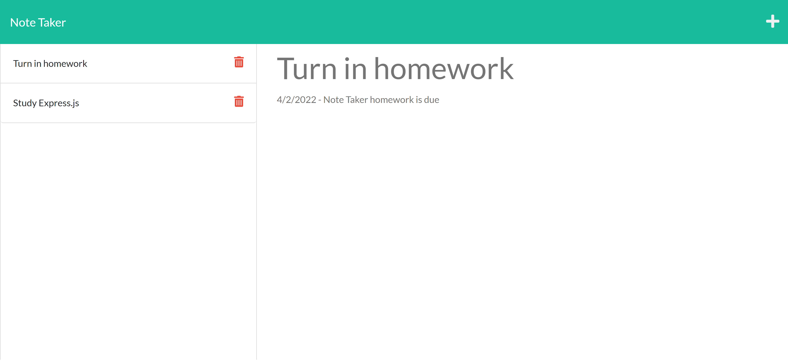

# note-taker

## Table of Content
- [Objectives](#objectives)
- [Screenshots](#screenshots)
- [Contributors](#contributors)
- [Technologies Used](#technologies-used)
- [Links](#links)
- [License](#license)

## Objectives
For this assignment, the HTML, CSS and JavaScript controlling the main functionality were given to us. The objective for this assignment was to create server routes utilizing express.js that allows a user to write and save notes.

## Screenshots

## Contributors
Kelly Jefferies
Daniel Norred

## Technologies Used
- JavaScript
- Node
- Express.js
- HTML/CSS
- UUID
- Heroku

## Links
[GitHub Repository](https://github.com/eugene125/note-taker)  
[Deployed Heroku](https://note-taker-ea.herokuapp.com/)

## License
This project is licensed under MIT License